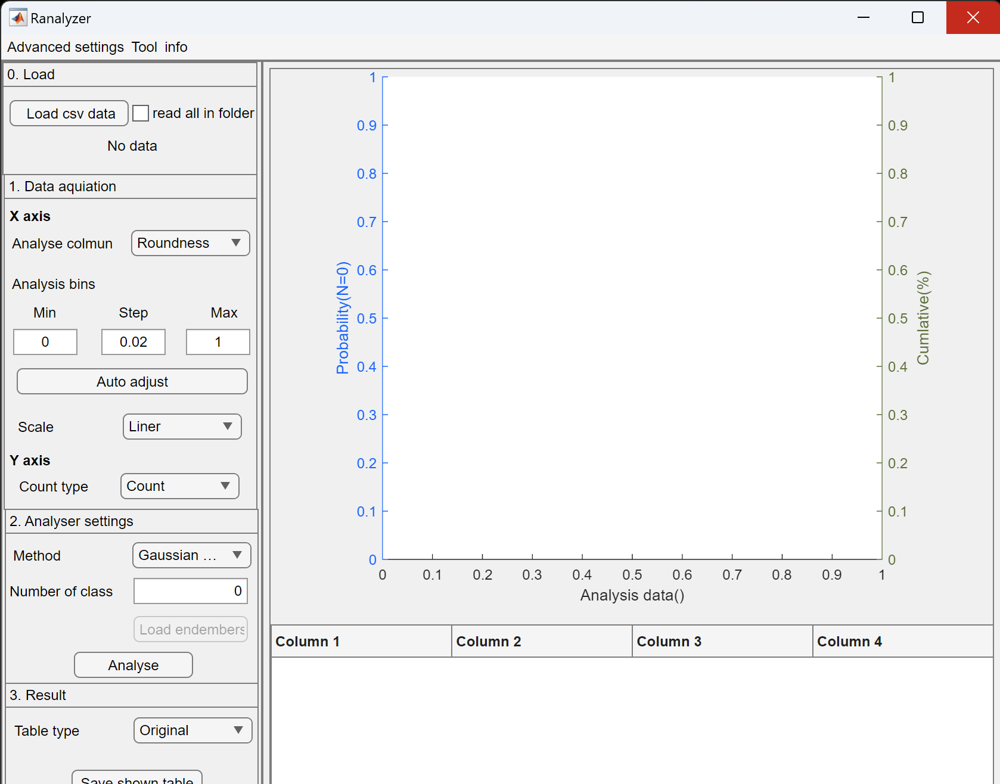

# Ranalyser

---
## 1. About Ranalyser 
Ranalyser is a support app for Rgrains. This app allows us to fit statistical distribution or other measurement dataset.

---
## 2. Requirements (test emvironments)
- Windows 10, 11 (Intel)
- Mac Sonoma 14.1.1 (Apple M1)
- Matlab Runtime (Rgrains includes this online installer)

---
## 3. Install
The Ranalyser has two versions: Matlab app and exective format.
### 3.1. GUI version (matlab app)
1. Download installer file from releases.
2. Install from "Apps" tab in the Matlab.

### 3.2. GUI version (executable file)
1. Download the executable file from Releases.
2. Follow the wizard to install.

---
## 4. Usage
Instructions on how to use each version is available in the **[Ranalyser Usage](https://github.com/keitaroyamada/Ranalyser/wiki)**.

---
